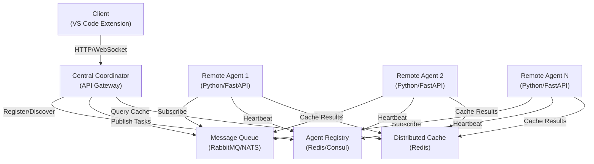
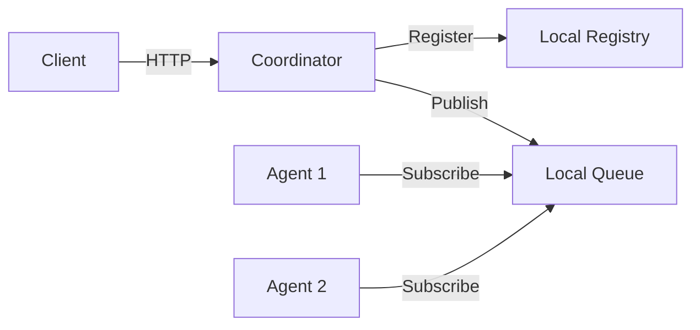
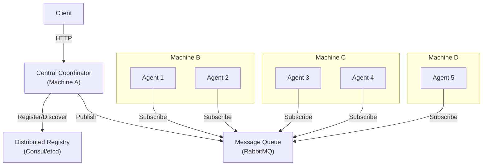

# Remote Agent Architecture

## 1. Overview

The Remote Agent Architecture enables ContextForge to scale beyond a single machine by distributing workloads across multiple agent nodes. This design supports:

- **Scalability**: Distribute processing across multiple machines
- **Load Distribution**: Balance workloads across available agents
- **Fault Tolerance**: Continue operation when individual agents fail
- **Specialization**: Deploy specialized agents for specific tasks (language analysis, code review, etc.)
- **Low Latency**: Deploy agents closer to data sources or users

### Key Benefits

1. **Horizontal Scaling**: Add more agents to increase capacity
2. **Resilience**: System continues operating with partial agent failures
3. **Performance**: Parallel processing of independent tasks
4. **Flexibility**: Mix and match agent types for different workloads

---

## 2. Architecture Diagram

### System Architecture Overview



### Single-Machine Deployment



### Multi-Machine Deployment



---

## 3. Agent Communication Patterns

### Request/Response Pattern (Synchronous)

Used for immediate operations requiring direct feedback:

```
Client → Coordinator → Agent → Process → Response → Coordinator → Client
```

**Use Cases:**
- File analysis requests
- Code review queries
- Immediate status checks

### Pub/Sub Pattern (Asynchronous)

Used for long-running operations and event-driven workflows:

```
Coordinator → Message Queue → Multiple Agents → Process in Parallel
```

**Use Cases:**
- Batch processing
- Repository indexing
- Distributed analysis tasks

### Heartbeat/Health Check Mechanism

Agents send periodic heartbeats to the registry:

```
Agent → Registry: {"agent_id": "agent-1", "status": "healthy", "timestamp": "2025-10-18T00:00:00Z"}
Registry → Coordinator: Update agent availability
Coordinator: Route tasks only to healthy agents
```

**Heartbeat Interval**: 5-10 seconds
**Timeout Threshold**: 30 seconds (agent marked as unhealthy)

### Message Queue Architecture

```
Task Submission → Queue → Agent Pool → Task Processing → Result Storage
```

**Queue Types:**
- **Priority Queue**: High-priority tasks processed first
- **FIFO Queue**: First-in-first-out for standard tasks
- **Dead Letter Queue**: Failed tasks for retry/analysis

---

## 4. API Endpoints and Protocols

### REST API Endpoints

```
POST   /agents/register          - Register new agent
DELETE /agents/{agent_id}        - Deregister agent
GET    /agents                   - List all agents
GET    /agents/{agent_id}        - Get agent details
GET    /agents/health            - Health check all agents

POST   /tasks/submit             - Submit new task
GET    /tasks/{task_id}          - Get task status
GET    /tasks/{task_id}/result   - Get task result
DELETE /tasks/{task_id}          - Cancel task

GET    /metrics/agents           - Agent metrics
GET    /metrics/tasks            - Task metrics
GET    /metrics/performance      - Performance metrics
```

### WebSocket Endpoints

```
WS /tasks/stream/{task_id}       - Real-time task updates
WS /agents/stream                - Real-time agent status
WS /metrics/stream               - Real-time metrics
```

### gRPC Endpoints (High-Performance)

```
service AgentService {
  rpc RegisterAgent(RegisterRequest) returns (RegisterResponse);
  rpc SubmitTask(TaskRequest) returns (TaskResponse);
  rpc GetTaskStatus(TaskStatusRequest) returns (TaskStatusResponse);
  rpc StreamResults(TaskId) returns (stream Result);
}
```

### Authentication & Authorization

- **API Key Authentication**: For agent registration
- **JWT Tokens**: For client requests
- **mTLS**: For agent-to-coordinator communication
- **Rate Limiting**: Per-agent and per-client limits

---

## 5. Security Considerations

### TLS/SSL Encryption

- All communication encrypted with TLS 1.3
- Certificate pinning for agent-coordinator connections
- Automatic certificate rotation

### Authentication

- **Agent Registration**: Requires valid API key
- **Client Requests**: JWT token validation
- **Service-to-Service**: mTLS with certificate verification

### Network Isolation

- Agents in private network (not exposed to internet)
- Coordinator behind API gateway with firewall rules
- VPN/SSH tunneling for remote agent connections

### Secrets Management

- Environment variables for sensitive data
- HashiCorp Vault integration for credential rotation
- Encrypted storage for API keys and tokens

### Rate Limiting & DDoS Protection

- Per-IP rate limiting (100 req/min)
- Per-agent rate limiting (1000 tasks/min)
- Request size limits (100MB max)
- Connection pooling with limits

---

## 6. Load Balancing & Failover

### Load Balancing Strategies

**Round-Robin**
```
Task 1 → Agent 1
Task 2 → Agent 2
Task 3 → Agent 3
Task 4 → Agent 1 (cycle repeats)
```

**Least Connections**
```
Route to agent with fewest active tasks
Prevents overloading specific agents
```

**Weighted Distribution**
```
Agent 1 (weight: 3) → 60% of tasks
Agent 2 (weight: 2) → 40% of tasks
```

### Health Checks

```
Every 5 seconds:
  - Ping agent endpoint
  - Check CPU/Memory usage
  - Verify task queue status
  
If unhealthy (3 consecutive failures):
  - Mark agent as unavailable
  - Redistribute tasks
  - Alert monitoring system
```

### Circuit Breaker Pattern

```
CLOSED (normal) → OPEN (too many failures) → HALF_OPEN (testing) → CLOSED
```

### Graceful Degradation

- Continue with available agents
- Queue tasks for failed agents
- Retry with exponential backoff
- Fallback to local processing if needed

### Task Retry & Dead Letter Queue

```
Task Submission
  ↓
Processing
  ├─ Success → Complete
  ├─ Failure (retriable) → Retry Queue (exponential backoff)
  └─ Failure (non-retriable) → Dead Letter Queue
```

---

## 7. Use Cases & Examples

### Use Case 1: Distributed Code Analysis

```
Input: Large repository (10GB+)
Process:
  1. Coordinator splits repo into chunks
  2. Distribute chunks to 5 agents
  3. Each agent analyzes independently
  4. Results aggregated by coordinator
Output: Complete analysis in 1/5 time
```

### Use Case 2: Parallel Processing

```
Input: 1000 files to analyze
Process:
  1. Submit 1000 tasks to queue
  2. 10 agents process in parallel
  3. Each agent handles ~100 files
  4. Results cached for future queries
Output: 10x faster processing
```

### Use Case 3: Multi-Region Deployment

```
Regions: US-East, US-West, EU
Setup:
  - Coordinator in US-East
  - Agents in each region
  - Local cache in each region
Benefit: Low latency for regional users
```

---

## 8. Implementation Roadmap

### Phase 1: Single Remote Agent Support (Weeks 1-2)
- [ ] Agent registration endpoint
- [ ] Task submission API
- [ ] Basic health checks
- [ ] Simple round-robin load balancing

### Phase 2: Multiple Agent Coordination (Weeks 3-4)
- [ ] Agent discovery and registry
- [ ] Message queue integration
- [ ] Pub/Sub pattern implementation
- [ ] Advanced load balancing

### Phase 3: Auto-Scaling & Resilience (Weeks 5-6)
- [ ] Circuit breaker pattern
- [ ] Automatic failover
- [ ] Task retry logic
- [ ] Dead letter queue handling

### Phase 4: Advanced Features (Weeks 7-8)
- [ ] Distributed caching
- [ ] Performance monitoring
- [ ] Distributed tracing
- [ ] Agent specialization

---

## 9. Configuration Examples

### Agent Registration (YAML)

```yaml
agent:
  id: "agent-1"
  name: "Code Analysis Agent"
  type: "code-analyzer"
  capabilities:
    - python
    - javascript
    - typescript
  resources:
    cpu: "4"
    memory: "8Gi"
    disk: "100Gi"
  endpoint: "http://agent-1.internal:8001"
  registry:
    url: "consul://consul.internal:8500"
    heartbeat_interval: 5s
```

### Coordinator Settings (YAML)

```yaml
coordinator:
  port: 8080
  agents:
    health_check_interval: 5s
    health_check_timeout: 3s
    max_failures: 3
  load_balancing:
    strategy: "least_connections"
    timeout: 30s
  queue:
    type: "rabbitmq"
    url: "amqp://rabbitmq.internal:5672"
    prefetch_count: 10
```

### Network Configuration (YAML)

```yaml
network:
  tls:
    enabled: true
    cert_path: "/etc/certs/coordinator.crt"
    key_path: "/etc/certs/coordinator.key"
    ca_path: "/etc/certs/ca.crt"
  rate_limiting:
    per_ip: "100/min"
    per_agent: "1000/min"
  firewall:
    allowed_ips:
      - "10.0.0.0/8"
      - "172.16.0.0/12"
```

### Security Settings (YAML)

```yaml
security:
  authentication:
    type: "jwt"
    secret_key: "${JWT_SECRET}"
    expiration: "24h"
  authorization:
    enabled: true
    policy_file: "/etc/policies/rbac.yaml"
  secrets:
    backend: "vault"
    vault_addr: "https://vault.internal:8200"
    vault_token: "${VAULT_TOKEN}"
```

---

## 10. Monitoring & Observability

### Key Metrics

- **Agent Metrics**: CPU, Memory, Disk, Task Queue Length
- **Task Metrics**: Submission Rate, Success Rate, Average Duration
- **System Metrics**: Request Latency, Error Rate, Throughput

### Logging

- Structured logging (JSON format)
- Log levels: DEBUG, INFO, WARN, ERROR
- Centralized log aggregation (ELK Stack)

### Distributed Tracing

- OpenTelemetry integration
- Trace propagation across agents
- Performance bottleneck identification

### Alerting

- Agent health alerts
- Task failure alerts
- Performance degradation alerts
- Resource utilization alerts

---

## 11. Future Enhancements

- **Kubernetes Integration**: Native K8s deployment
- **Auto-Scaling**: Dynamic agent provisioning
- **Machine Learning**: Intelligent task routing
- **Edge Computing**: Deploy agents on edge devices
- **Blockchain**: Immutable task audit trail

